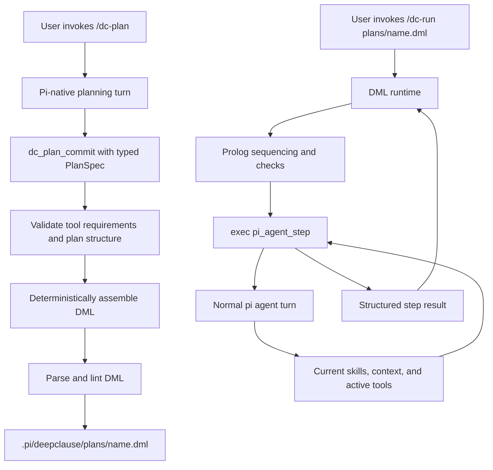

# `/dc-plan`: pi-native planning with executable DML

## Status

Implemented for `deepclause-pi` 0.1.2. This document retains the architecture and security rationale behind the implementation. The output is an executable DML program: **the DML file is the plan**. There is no Markdown plan and no Markdown-to-DML compiler.

The shipped implementation includes the normal pi planning turn, transaction-scoped typed `dc_plan_commit`, deterministic DML assembly and validation, non-destructive `plans/` output, bounded `pi_agent_step` delegation, exact active-tool scoping and restoration, user confirmation, cancellation, and rejection through model-callable `dc_run`. Schema hashing and richer preflight drift reports remain possible later enhancements.

## Revised design goal

A generated plan should not be limited to the small host-tool boundary used by ordinary DML tasks. Planning and plan execution should be able to benefit from the current pi environment:

- the effective pi system prompt, including context files and additions from extensions
- loaded skill metadata and instructions
- the current compacted or forked session branch
- the selected model, credentials, and thinking level
- built-in pi tools
- tools registered by other extensions
- the tools currently active for the user
- normal tool UI, approval, cancellation, and result rendering

This changes the architecture. Merely copying the SDK `plan.dml` and exposing more tool schemas to the DeepClause model loop is insufficient.

## Important API finding

Pi exposes enough information to **discover** the environment:

- `ctx.getSystemPrompt()` returns the effective system prompt.
- Command contexts additionally expose `ctx.getSystemPromptOptions()`, whose structured value includes context files, loaded skills, tool snippets, prompt guidelines, and appended prompt text.
- `ctx.sessionManager.getBranch()` returns the active linear branch, including compacted-history entries.
- `pi.getActiveTools()` returns the current active tool names.
- `pi.getAllTools()` returns every configured tool's name, description, parameter schema, prompt guidelines, and source metadata.
- `pi.getThinkingLevel()` and `ctx.thinkingLevel` expose current reasoning configuration.

Pi does **not** expose a public `invokeTool(name, args)` API to extensions. `getAllTools()` deliberately returns metadata without each tool's `execute` closure. Consequently, DeepClause cannot safely mirror arbitrary built-in and third-party extension tools into `exec/2` by itself.

Passing all pi tool schemas to `modelRegistry.complete()` would let the model request those tools, but there would be no supported dispatcher to execute the calls. Pretending otherwise would create plans that look capable but fail at runtime.

## Core architectural decision

Use pi itself as the contextual worker for plan creation and for plan steps that require pi capabilities.

DML remains the orchestration language. It decides step order, alternatives, deterministic checks, constraints, progress, and fallback. A new host operation delegates selected steps to a normal pi agent turn, where pi supplies its complete current prompt, skills, extensions, active tools, UI, approvals, and session semantics.



## Planning phase

### `/dc-plan` starts a normal pi turn

The command should not perform a headless one-shot completion. A one-shot `modelRegistry.complete()` call can inspect supplied text and schemas but cannot use pi's tools. Instead, `/dc-plan <request>` should start a regular pi agent turn with a temporary, narrowly scoped commit capability.

Conceptual flow:

1. Verify pi is idle and a model is selected.
2. Initialize `.pi/deepclause/` and the `plans/` directory non-destructively.
3. Snapshot the effective planning environment:
   - effective system prompt
   - structured prompt options and loaded skills
   - current branch and context usage
   - all tool metadata
   - active tool names
   - existing DML skills and plans
   - model and thinking level
4. Register or activate `dc_plan_commit` for this planning transaction only.
5. Send a planning request into the current pi session with `pi.sendUserMessage()`.
6. Let pi inspect the workspace, consult relevant skills, and call active built-in or extension tools under their normal policies.
7. Require the planning turn to finish by calling `dc_plan_commit(PlanSpec)`.
8. Validate and assemble the DML deterministically.
9. Show a preview and ask before writing.
10. Deactivate `dc_plan_commit` and return the generated plan path.

Because this is a normal pi turn, `before_agent_start` hooks run and the planning model sees the effective system prompt assembled by pi. It does not need a stale copy embedded by DeepClause.

### Why a commit tool

The planning model should produce a typed plan specification, not raw DML source. `dc_plan_commit` is analogous to the SDK task loop's structured result tool, but its output is richer and checked against the live pi environment.

Suggested shape:

```ts
interface PlanSpec {
  slug: string;
  title: string;
  objective: string;
  assumptions: string[];
  steps: Array<{
    id: string;
    title: string;
    instruction: string;
    executor: "pi" | "dml";
    requiredTools: string[];
    relevantSkills: string[];
    expectedResult: string;
    continueWhen?: ResultCondition;
  }>;
  finalSynthesis?: string;
  failureMessage: string;
}
```

The planner chooses `executor: "pi"` when a step needs current skills, repository context, built-in tools, or another extension. It chooses `executor: "dml"` when ordinary DML, typed model reasoning, Prolog, CLP, or the restricted DeepClause tools are sufficient.

`requiredTools` must contain exact names from the planning-time `getAllTools()` catalog. `relevantSkills` records why a loaded skill informed the step, but it does not copy the complete skill or system prompt into the generated file.

### Planning-time tool decisions

The planner receives two distinct inventories:

- **Available tools:** all metadata from `getAllTools()`.
- **Currently active tools:** names from `getActiveTools()`.

It may inspect unavailable-but-configured tools for planning, but the commit validator should flag any requirement that is not currently active. The user can either revise the plan or explicitly activate the tool. `/dc-plan` must never silently enable tools.

The planner should prefer capabilities in this order:

1. deterministic Prolog or CLP
2. current DML helpers
3. a narrow active pi tool
4. a relevant loaded skill or extension capability
5. approval-gated shell only when no safer capability fits

## Generated DML

The assembler owns all DML syntax and quoting. The model never writes the source directly.

A generated plan can mix local DML reasoning and pi-native steps:

```prolog
% Generated by /dc-plan. This DML file is the executable plan.
% Planning tool snapshot: read, edit, bash, test

agent_main :-
    output("Step 1/4: analyzing requirements with current pi context..."),
    exec(pi_agent_step(
        instruction: "Inspect the request, relevant project instructions, loaded skills, and repository structure. Produce a concise implementation map.",
        tools: [read, find, grep],
        expected: "Implementation map with concrete files and constraints"
    ), AnalysisResult),
    get_dict(success, AnalysisResult, true),
    get_dict(summary, AnalysisResult, Analysis),

    output("Step 2/4: applying deterministic acceptance constraints..."),
    acceptable_analysis(Analysis),

    output("Step 3/4: implementing and validating through pi..."),
    exec(pi_agent_step(
        instruction: "Implement the smallest coherent change based on the prior plan context, run focused validation, and repair failures caused by the change.",
        tools: [read, edit, bash, test],
        expected: "Changed files, validation results, and remaining risks"
    ), ImplementationResult),
    get_dict(success, ImplementationResult, true),
    get_dict(summary, ImplementationResult, Summary),

    output("Step 4/4: preparing the final report..."),
    task("Summarize this completed plan result for the user: {Summary}. Store it in Report.",
         string(Report)),
    answer(Report).

agent_main :-
    answer("The plan could not be completed safely. Review the visible step results and retry or revise the plan.").
```

The exact tool list is data in each `pi_agent_step`. The DML runtime does not receive or invoke arbitrary tool implementations directly.

## `pi_agent_step` execution bridge

### Semantics

`pi_agent_step` asks the current pi agent to execute one bounded instruction as a normal turn and waits for that turn to settle.

It should return a dict such as:

```ts
{
  success: boolean;
  summary: string;
  toolsUsed: string[];
  errors: string[];
  turnEntryIds: string[];
}
```

The delegated turn naturally receives:

- current effective pi system prompt
- context files and extension prompt additions
- loaded skills
- the current session branch, including earlier delegated steps
- current model and thinking level
- normal tool execution and rendering
- provider and extension hooks

This is superior to serializing the complete system prompt into DML. It uses current context at execution time, avoids leaking or freezing irrelevant instructions, and respects changes made after plan creation.

### Tool scoping

Before a delegated turn:

1. Read the current active-tool snapshot.
2. Verify every requested tool still exists in `getAllTools()`.
3. Verify every requested tool is currently active.
4. Reject missing or inactive requirements; never activate them silently.
5. Temporarily scope active tools to the intersection requested by the plan plus any unavoidable pi core mechanism.
6. Always exclude `dc_run`, `dc_plan_commit`, and future planning/execution control tools to prevent recursion.
7. Start the delegated turn.
8. Capture `turn_end`, `agent_end`, tool lifecycle events, and final assistant text.
9. Wait for `agent_settled` before resuming DML.
10. Restore the exact prior active-tool snapshot in `finally`.

Other extensions retain control of their tools. Their own validation, approval dialogs, hooks, cancellation, and rendering execute normally because pi—not DeepClause—dispatches the tool call.

### Event correlation

Only one DeepClause execution is already allowed at a time. Extend that guard with one delegated-step transaction containing a unique plan ID and step ID. Register extension event handlers once and route the next matching agent turn to the pending transaction.

The step prompt should contain an internal correlation marker and explicit completion contract. The correlation marker must not be interpreted as authority and should be omitted from the user-facing summary.

Cancellation must abort both the DML controller and the active pi turn. Session shutdown, session switching, or branch navigation fails the step and stops the plan.

### Re-entrancy restriction

A plan that uses `pi_agent_step` can only be started by a user command while pi is idle. It cannot run inside the model-callable `dc_run` tool because that tool is already executing within a pi agent turn; starting another agent turn would be recursive and unsafe.

Therefore:

- `/dc-run plans/name.dml` may execute contextual pi steps.
- `dc_run` must reject plans requiring `pi_agent_step` with `interactive_plan_requires_user_run`.
- Ordinary skills that do not use the bridge remain callable through `dc_run` when enabled.

This boundary must be explicit in the UI and authoring guide.

## Skills and context handling

### Planning

`getSystemPromptOptions()` exposes loaded skill objects and context files to the command. The planning turn also receives the fully assembled prompt through normal pi startup. The planner can decide that a skill is relevant, inspect it through ordinary pi mechanisms when needed, and record the skill name in the plan specification.

### Execution

Do not paste all skill content or the complete effective system prompt into generated DML. That would:

- make plans stale
- duplicate large context
- risk persisting sensitive or irrelevant instructions
- disconnect execution from future extension and skill updates

Instead, a `pi_agent_step` reacquires the current effective pi context. A generated step may name relevant skills as a hint, but current pi decides how those skills are represented and used.

### DML-local tasks

A normal DML `task/N` still receives the DeepClause memory selected by `turn`, `branch`, or `isolated`. It does not automatically receive the complete pi system prompt or arbitrary pi tools. This distinction is desirable:

- use `task/N` for a contained DeepClause subtask
- use `pi_agent_step` for work that intentionally needs the full pi environment

The UI and generated comments should make the executor boundary visible per step.

## Security and consent model

### Plan creation

- `/dc-plan` is user-triggered.
- Planning uses only tools already active in pi.
- Tool calls remain subject to their normal policies.
- `dc_plan_commit` accepts data but cannot execute the generated plan.
- The assembler writes only below `.pi/deepclause/plans/`.
- Existing plans are never overwritten silently.
- The user sees the step list, executor choice, required tools, and relevant skills before commit.

### Plan execution

- Starting a contextual plan requires a user slash command.
- Show a preflight summary before the first delegated turn.
- All required tools must still be active.
- Other extensions' policies remain authoritative.
- Approval of the plan does not imply approval of every shell or privileged tool call.
- The plan cannot activate tools, alter provider credentials, or mutate pi configuration.
- Recursion into `dc_run`, `/dc-plan`, or plan commit is blocked.
- Every delegated step is visible in the current pi session, which remains the sole execution record.

## Plan portability and drift

A plan should record descriptive metadata as DML comments or harmless facts:

- generation timestamp
- plan format version
- requested tool names
- tool source identifiers when available
- optional stable hashes of parameter schemas
- relevant skill names
- planning model label

At execution, compare current tools with this snapshot:

- Missing required tool: fail preflight.
- Tool exists but is inactive: ask the user to activate it outside the plan.
- Schema changed: warn and require confirmation or regeneration.
- Additional tools exist: ignore unless explicitly requested by a step.
- Skill missing or changed: warn, but allow the user to continue if it was guidance rather than a hard dependency.

Do not persist the full effective system prompt, credentials, tool implementation paths beyond what is needed for diagnostics, or session content in the plan.

## Command surface

```text
/dc-plan <request>
/dc-plan <request> --name=<slug>
/dc-plan <request> --context=turn|branch
/dc-plan <request> --debug
/dc-run plans/<slug>.dml
```

`isolated` planning can be supported for DML-only plans. It conflicts with the goal of using current pi skills and context, so `/dc-plan` should default to `branch` or an explicit `current` planning mode rather than ordinary DML's `turn` default.

`/dc-list` should separate reusable skills from generated plans.

## Workspace layout

```text
.pi/deepclause/
├── config.json
├── AGENTS.md
├── DML_REFERENCE.md
├── plans/
│   └── migrate_to_esm.dml
└── skills/
    ├── example.dml
    └── deep_research.dml
```

Plans are request-specific orchestration. Skills are reusable programs. Both are DML and use the same parser and path isolation.

## Implementation phases

### Phase 1: contextual planning and DML generation

- Add `/dc-plan`.
- Run planning as a normal pi turn.
- Add transaction-scoped `dc_plan_commit`.
- Collect effective prompt options, loaded skills, tool catalog, active tools, model, thinking level, and branch metadata.
- Validate a typed `PlanSpec`.
- Deterministically assemble and statically validate DML.
- Save non-destructively under `plans/`.
- Initially generate DML-only and the already supported restricted operations.

This phase proves plan quality and the plan format without pretending arbitrary tools are executable.

### Phase 2: pi-native delegated execution

- Add `pi_agent_step` only for user-triggered plan runs.
- Implement correlated agent-turn delegation and result capture.
- Add exact tool snapshot/scoping/restoration.
- Preserve extension approvals and lifecycle events.
- Add preflight, plan-level confirmation, cancellation, and session-change handling.
- Reject delegated plans from model-callable `dc_run`.

### Phase 3: advanced DML planning

- Typed conditions between steps.
- Prolog and CLP acceptance constraints.
- Multiple `agent_main` strategy clauses.
- User-editable plan review and regeneration.
- Optional independent verification turns.
- Explicit step outputs that subsequent DML predicates can inspect.

## Tests required

### Planning context

- Effective system prompt additions are present in the planning turn.
- Context files and loaded skill metadata are visible.
- Compacted and forked branch context behaves correctly.
- All and active tool inventories differ correctly.
- A tool registered by a test extension appears in the planner catalog.

### Plan commit

- Unknown, inactive, recursive, or malformed tool requirements are rejected.
- Raw model DML is never accepted.
- Strings are quoted by the assembler.
- Existing plans are preserved.
- Path traversal and symlink escape are rejected.
- Generated DML passes the SDK parser/linter.

### Delegated execution

- A built-in tool and a mock third-party extension tool execute through normal pi dispatch.
- Third-party approval denial propagates into the DML step result.
- Tool subsets are enforced and restored after success, failure, and cancellation.
- `dc_run` and planning tools are unavailable inside delegated turns.
- The next DML step receives the prior step summary.
- Compaction and session closure stop or resume according to explicit policy.
- A model-triggered `dc_run` cannot start a contextual plan.

## Decision summary

The desired behavior is possible only if the generated plan delegates contextual work back to pi rather than trying to clone pi's environment inside DeepClause.

The key separation is:

- **DML is the plan and orchestrator.**
- **Pi is the contextual worker and tool dispatcher.**
- **The SDK task loop remains available for contained DML-native reasoning.**

This preserves the benefits of DML—executable structure, typed data, Prolog control, backtracking, and constraints—while using pi's live skills, session context, built-in tools, and extension ecosystem without bypassing their policies.
