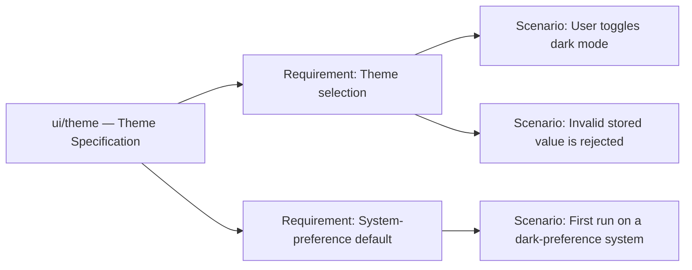
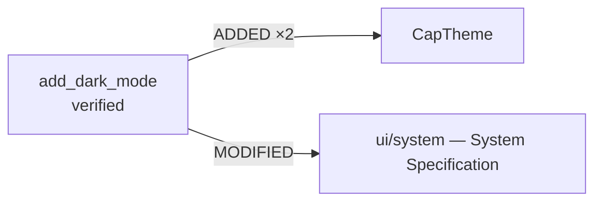
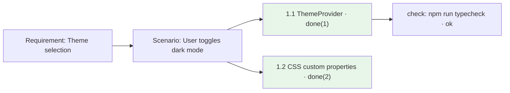
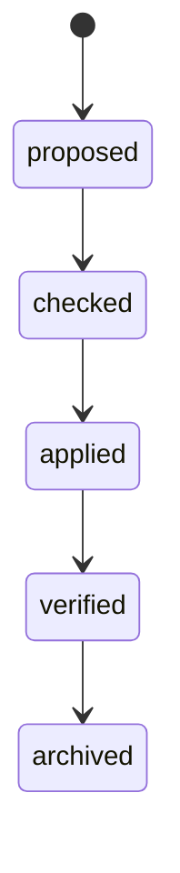

# A DeepClause spec layer for `deepclause-pi`

## Status

**Design sketch; phase 1 implemented on branch `feat/spec-layer-phase1`.** This
document records the design discussion that started from
[OpenSpec](https://github.com/Fission-AI/openspec) and asks how its ideas map onto
DML and the existing `deepclause-pi` plan/executor model.

Implemented in phase 1: the deterministic engine (`src/assets/specs.dml`), the
`spec_validate` / `spec_status` / `spec_query` / `spec_graph` skills, `/dc-check`,
the `dc_spec_graph` tool, and workspace seeding of `specs/`, `changes/` and `lib/`.

Implemented in phase 2: delta merging (`sp_archive/3`, `spec_merge.dml`,
`spec_archive.dml`) and the `/dc-archive` command, which previews the merge,
confirms, writes `specs/`, and moves the change folder to `changes/archive/`.
Unchanged requirement blocks are preserved line-for-line. The archive *move* is
done host-side because directory `rename_file/2` is unreliable in the WASM
filesystem. `RENAMED` deltas are refused for now.

Implemented in phase 3: `tasks.dml` as a first-class artifact (`plan_task/2`
facts read with native term I/O), scenario coverage reporting (`spec_coverage.dml`
and a coverage section in `/dc-check`), and a read-only `spec_scaffold.dml` that
drafts one task per delta scenario. Note the `plan_task` naming: `task/2` collides
with DML's built-in `task/N`.

Implemented in phase 4: the task driver (`lib/apply.dml`) with per-task declarative
checks (`exists`, `cmd`, `model`), bounded retry that threads the failure feedback
into the repair instruction, and a managed `plan_task_status/2` write-back block in
`tasks.dml`; the allowlisted `dc_verify_run` tool; the `spec_apply.dml` skill; and
`/dc-apply <change>`, which previews the tasks and the exact command set, confirms,
then applies with `pi_agent_step` and `dc_verify_run` enabled.

Not yet implemented: the `deltas.dml` / `index.dml` files, and `RENAMED` support in merge.

Implemented in phase 6: apply-time rollback. `dc_apply_snapshot` records a git ref
(refusing a dirty tree) in `change.json`; `dc_apply_accept` clears it on success; the
`/dc-apply` harness restores on any run that does not report `status: OK`, including
cancellation, using `git reset --hard` plus `git clean -fd`. When no snapshot is
available (not a git repo, or a dirty tree) the apply proceeds and the report says
rollback is unavailable. Two runtime quirks surfaced: `exists_file/1` is unreliable
in the WASM filesystem (use `open/2`), and a DML predicate named `snapshot/1`
collides with a runtime accessor, so the driver uses `take_snapshot/1`.

Implemented in phase 5: change-aware planning. `/dc-plan <request> --change=<slug>`
writes `changes/<slug>/tasks.dml` (`plan_task/2` with `satisfies` and encoded
`checks`, plus the managed status block) instead of a standalone plan. Check
encoding is `cmd:<command>`, `exists:<path>` or `model:<question>`; change plans
require at least one check per step, and step ids may be OpenSpec-style (`1.1`).
The planning prompt also instructs pi to create the change's proposal and delta
specs before committing. Coverage is validated by `/dc-check`, and the flow is
closed by `/dc-apply` and `/dc-archive`.

It builds directly on [DC_PLAN_PROPOSAL.md](DC_PLAN_PROPOSAL.md), which describes
the shipped `/dc-plan` + `pi_agent_step` architecture. This document does not
change that architecture; it proposes a spec layer on top of it.

Revision note: an earlier draft attached executable checks to requirements and
kept a Markdown `tasks.md`. Both were wrong and are corrected below — checks are
implementation details and live in `tasks.dml`, and Markdown is canonical only for
behavior.

Related reading:

- `.pi/deepclause/AGENTS.md` — DML authoring rules for this integration
- `.pi/deepclause/DML_REFERENCE.md` — bundled DML language reference
- `docs/AUTHORING_GUIDE_ANALYSIS.md` — why the authoring guide looks the way it does

## Goals

- Give pi a place to agree on **what to build** before building it: specs as the
  source of truth, changes as reviewable deltas.
- Make spec **validation and merging deterministic DML**, not model judgment and
  not more TypeScript string handling.
- Make `apply` an **executable, verifiable plan**: per-task implementation checks,
  bounded repair retries, and a deterministic rollback path.
- Stay inside the existing constraints: minimal slash commands, no Markdown-to-DML
  compiler, user-triggered execution, opt-in model-callable `dc_run`.

## Non-goals

- **No natural-language → DML compiler.** Parsing and validating a *structured*
  spec is deterministic logic. Turning prose into DML is not, and stays out.
- **No second session store.** `.pi/deepclause/` is files; pi remains the session
  owner. The parsed term tree is never persisted.
- **No reimplementation of OpenSpec's CLI.** It has a mature CLI and a 30+ tool
  integration matrix. Only two things are borrowed: the spec/change convention and
  the artifact-graph idea.
- **No new top-level commands beyond the agreed set.** OpenSpec's phase commands
  (`propose`, `apply`, `archive`, `verify`, …) become arguments to `/dc-plan` and
  named skills run with `/dc-run`.

## The mental model

> **Specs are behavior. Changes are executable. `/dc-plan` thinks and writes;
> `/dc-run` proves and applies.**

Two verbs for the user, not twelve. Four artifacts per change, each with one job:

| Layer | Artifact | Answers | Canonical form |
|---|---|---|---|
| Behavior | `specs/**`, delta | *what must be true* | Markdown |
| Approach | `design.md` (optional) | *how, and why* | Markdown |
| Implementation | `tasks.dml` | *what to do, and how far we got* | DML facts |
| Execution | `apply.dml` | *how to drive it* | DML program |

The rule that keeps them separate:

> **Markdown is canonical only for behavior and rationale. Anything executable,
> enumerable, or stateful — tasks, checks, progress — is DML data.**

## The workflow in practice (user perspective)

You describe what you want in plain language — "add dark mode with
system-preference detection" — and run `/dc-plan`. Pi explores the repository,
reads the existing specs, and writes a change folder: a proposal, a behavior-only
delta under `changes/<slug>/specs/`, an optional `design.md`, plus `tasks.dml` (the
implementation plan, each task carrying its verification) and `apply.dml` (the
executable entry). Nothing is final until you approve it at the commit dialog, and
the specs themselves are plain Markdown you can read and hand-edit at any time.

`/dc-check <change>` then validates everything deterministically with zero model
calls — grammar, delta consistency, scenario coverage, discoverable checks, and
conflicts with other in-flight changes. `/dc-run <change>` executes the plan: it
delegates each bounded step to pi with exactly the tools that step needs, runs the
task's declared checks, and on a failed check retries with the failure evidence fed
back into the repair attempt. You approve the verification commands once as a suite
rather than per invocation, and if a task cannot be repaired the working tree is
restored from the snapshot taken at the start, so a failed apply never leaves a
half-applied change.

When it succeeds, `/dc-run spec_archive <change>` shows a diff and merges the delta
into `specs/`, moves the change to `changes/archive/`, and updates the delta index.
Because features, deltas, tasks, and checks are all queryable facts, you can ask
questions no chat history can answer: which changes touch `ui/theme`, which
scenarios are still uncovered, whether two in-flight changes collide on the same
requirement, and which check proved which scenario. The conversation proposes, the
spec is the contract, the plan executes, and the facts let you audit.

The rest of this section walks the same path with exact commands, showing what
lands on disk at each step and what the runtime does while a plan is executing.

### 0. Bootstrap — `/dc`

```text
> /dc

  DeepClause pi runtime
  Model: anthropic/claude-sonnet-4
  Status: idle
  Root: .pi/deepclause
  Skills: .pi/deepclause/skills
  Plans: .pi/deepclause/plans
  Context: turn (verbose default: false)
  Model tool (dc_run): disabled
  Commands: /dc-list, /dc-plan, /dc-run, /dc-tool, /dc-cancel
```

**Files.** On first use, `initializeWorkspace()` creates
`.pi/deepclause/{config.json,AGENTS.md,DML_REFERENCE.md,skills/,plans/}` and seeds
`example.dml` and `deep_research.dml`. Every write uses `writeIfMissing`, so
existing user files are never overwritten. The spec layer adds `specs/`,
`changes/`, and `lib/`, seeded the same way.

### 1. Explore — just talk

```text
> how should we do theming without adding dependencies?

  [pi reads src/ styles, package.json, and specs/ui/system.spec.md,
   then answers in the session]
```

**No command, no files.** Exploration is ordinary conversation: pi's system prompt
already carries the DeepClause authoring instructions, so nothing has to be
"unlocked." There is no planning transaction, no `dc_plan_commit`, and no change
folder. Using `/dc-plan` here would open a transaction that never commits (and log
that fact in debug), so it is the wrong tool for a discussion you may never act on.

### 2. Plan — `/dc-plan`

```text
> /dc-plan add dark mode with system-preference detection --name=add_dark_mode

  ⚠ Starting a contextual pi planning turn. Review the generated plan before it is written.

  [pi explores: src/theme.ts, package.json, specs/ui/system.spec.md, changes/]
  [pi writes the Markdown artifacts with its normal tools]
  [pi calls dc_plan_commit]

  ⚠ Create executable DeepClause plan?
    Add dark mode
    Objective: Add a light/dark theme that defaults to the system preference.
    Steps: 5
    Pi tools: read, edit
    1. [pi] 1.1 Add a ThemeProvider context
    2. [pi] 1.2 Add light/dark CSS custom properties
    3. [pi] 1.3 Default to prefers-color-scheme
    4. [pi] 1.4 Reject invalid stored values
    5. [pi] 1.5 Add the theme toggle to the header
                                                      [Confirm]  [Cancel]
```

**Files after the turn:**

```text
changes/add_dark_mode/
├── change.json                 # schema, created, digests, snapshot ref
├── proposal.md                 # pi, normal tools
├── specs/ui/theme.spec.md      # pi, normal tools — behavior only
├── design.md                   # pi, normal tools
├── deltas.dml                  # emitted: delta ops + delta_status(pending)
├── tasks.dml                   # emitted: plan_task/2 definitions + plan_task_status/2
└── apply.dml                   # emitted: entry + "% Required pi tools:" metadata
```

**What happened during the turn.** Pi never writes DML. The Markdown artifacts are
written with ordinary file tools. `dc_plan_commit` then runs `validatePlanSpec`
against the live snapshot — every requested tool must exist *and* be currently
active, no step may request a control tool, every delta scenario must be covered,
and every `cmd(...)` check must be discoverable in the repo — then assembles the
DML with `assemblePlanDml`, validates it with `validateWithProlog`, and writes it
non-destructively. Result:

```text
  DeepClause
  Created change add_dark_mode
    proposal.md, specs/ui/theme.spec.md, design.md
    tasks.dml    5 tasks, 5 checks, 3 scenarios covered
    apply.dml    contextual plan (2 pi tools)
  Run it with: /dc-run add_dark_mode
```

**What is in the generated files.**

`proposal.md` — why, what, capabilities, impact:

```markdown
# Add dark mode

## Why
Users on dark-preference systems get a bright UI with no way to change it.

## What Changes
- Introduce a `ui/theme` capability for runtime theme selection.
- Default to the operating system colour-scheme preference on first run.
- Persist an explicit user choice.

## Capabilities
### New Capabilities
- `ui/theme`: runtime light/dark theme selection and persistence.

### Modified Capabilities
- `ui/system`: theme switching must no longer require a reload.

## Impact
- `src/theme/` (new), `src/app/App.tsx`, `index.html`
- No new dependencies.
```

`specs/ui/theme.spec.md` (inside the change) — the delta. Behavior only, no
implementation detail:

```markdown
---
change: add_dark_mode
schema: spec-driven
---

# Spec Delta

## Purpose
Lets users choose between light and dark themes, defaulting to the operating
system preference.

## ADDED Requirements

### Requirement: Theme selection
The app SHALL let users switch between light and dark themes at runtime.

#### Scenario: User toggles dark mode
- **WHEN** the user clicks the theme toggle
- **THEN** the app switches to dark mode and persists the choice

#### Scenario: Invalid stored value is rejected
- **WHEN** a stored theme value is neither "light" nor "dark"
- **THEN** the app falls back to the system preference and shows no error

### Requirement: System-preference default
The app SHALL default to the operating system colour-scheme preference when no
choice has been stored.

#### Scenario: First run on a dark-preference system
- **WHEN** the app starts with no stored theme and the OS reports dark
- **THEN** it renders dark without writing a stored choice
```

`specs/ui/system.spec.md` (inside the change) — the modification to an existing
capability:

```markdown
---
change: add_dark_mode
schema: spec-driven
---

# Spec Delta

## MODIFIED Requirements

### Requirement: Theme switching
The app SHALL apply theme changes without a full page reload.

#### Scenario: No reload on toggle
- **WHEN** the user toggles the theme
- **THEN** the visible theme updates in place and the document is not reloaded
```

`design.md` — approach and trade-offs, where implementation detail is allowed:

```markdown
# Design

## Context
The app reads a theme once from localStorage at boot (`src/app/App.tsx`).

## Goals / Non-Goals
**Goals:** no new dependencies; no reload on toggle.
**Non-Goals:** per-component theming; high-contrast mode.

## Decisions
- CSS custom properties on `:root`, not a CSS-in-JS theme object — no dependency,
  and it works with the existing stylesheet.
- `prefers-color-scheme` via `matchMedia`, read once at boot and subscribed for
  later changes.

## Risks / Trade-offs
- [Flash of the wrong theme on first paint] → set the class from an inline script
  before hydration.
```

`deltas.dml` — the delta as queryable facts plus lifecycle state:

```prolog
% deltas.dml — spec deltas for change add_dark_mode
% Derived from:
%   changes/add_dark_mode/specs/ui/theme.spec.md   sha256:9f2c…
%   changes/add_dark_mode/specs/ui/system.spec.md  sha256:41ab…

delta("add_dark_mode", added,    "ui/theme",  req("theme-selection", "Theme selection")).
delta("add_dark_mode", added,    "ui/theme",  req("system-preference", "System-preference default")).
delta("add_dark_mode", modified, "ui/system", req("theme-switching", "Theme switching")).

change_meta("add_dark_mode", schema(spec_driven), skip_specs(false),
            created("2025-09-17"), snapshot(none)).

% --- lifecycle state (managed by apply / spec_archive) ---
delta_status("add_dark_mode", "ui/theme",  "theme-selection",    pending).
delta_status("add_dark_mode", "ui/theme",  "system-preference", pending).
delta_status("add_dark_mode", "ui/system", "theme-switching",    pending).
```

`tasks.dml` — the implementation plan and its state. Note `satisfies` closes the loop
back to the delta's scenario ids, and every task declares at least one check:

```prolog
% tasks.dml — implementation plan for change add_dark_mode
% Plan format: 2

plan_task("1.1", task{
    executor:  pi,
    do:        "Add a ThemeProvider context exposing theme and setTheme.",
    tools:     ["read", "edit"],
    expected:  "src/theme/ThemeProvider.tsx exports ThemeProvider and typechecks.",
    satisfies: ["ui/theme#theme-selection"],
    checks:    [ exists("src/theme/ThemeProvider.tsx"),
                 cmd("npm run typecheck") ]
}).

plan_task("1.2", task{
    executor:  pi,
    do:        "Add light/dark CSS custom properties and apply them to the document root.",
    tools:     ["read", "edit"],
    expected:  "Toggling updates the visible theme without a reload.",
    satisfies: ["ui/theme#theme-selection", "ui/system#theme-switching"],
    checks:    [ cmd("npx vitest run src/theme") ]
}).

plan_task("1.3", task{
    executor:  pi,
    do:        "Default to prefers-color-scheme when nothing is stored, without persisting.",
    tools:     ["read", "edit"],
    expected:  "A first run on a dark system renders dark and writes no stored key.",
    satisfies: ["ui/theme#system-preference"],
    checks:    [ cmd("npx vitest run src/theme") ]
}).

plan_task("1.4", task{
    executor:  pi,
    do:        "Reject a stored value that is neither light nor dark, falling back to the system preference.",
    tools:     ["read", "edit"],
    expected:  "An invalid stored value renders the system preference and shows no error.",
    satisfies: ["ui/theme#invalid-stored-value"],
    checks:    [ cmd("npx vitest run src/theme") ]
}).

plan_task("1.5", task{
    executor:  pi,
    do:        "Add the theme toggle to the header.",
    tools:     ["read", "edit"],
    expected:  "The toggle switches themes and persists the choice.",
    satisfies: ["ui/theme#theme-selection"],
    checks:    [ exists("src/components/ThemeToggle.tsx"),
                 cmd("npm run typecheck") ]
}).

% --- execution state (managed by apply.dml; do not edit by hand) ---
plan_task_status("1.1", pending).
plan_task_status("1.2", pending).
plan_task_status("1.3", pending).
plan_task_status("1.4", pending).
plan_task_status("1.5", pending).
```

`apply.dml` — only wiring and the metadata `/dc-run` preflight reads, so the plan
file stays clean data:

```prolog
% apply.dml — executable entry for change add_dark_mode
% Plan format: 2
% Change: add_dark_mode
% Required pi tools: read, edit
% Contextual: true

:- consult('.pi/deepclause/lib/apply.dml').
:- consult('.pi/deepclause/changes/add_dark_mode/tasks.dml').

agent_main :-
    run_plan('.pi/deepclause/changes/add_dark_mode/tasks.dml',
             "add_dark_mode", 3).
```

`change.json` — the machine manifest the harness reads: schema, drift digests, and
the snapshot ref (still `null` until apply starts):

```json
{
  "schema": "spec-driven",
  "slug": "add_dark_mode",
  "created": "2025-09-17",
  "contextMode": "branch",
  "digests": {
    "specs/ui/theme.spec.md": "sha256:9f2c…",
    "specs/ui/system.spec.md": "sha256:41ab…"
  },
  "snapshot": null,
  "skipSpecs": false,
  "retireCapabilities": false
}
```

Why four artifacts instead of one: the **delta** is what a reviewer reads and what
archive merges; `deltas.dml` is that same delta as **facts** so `/dc-check` and
`spec_status` can reason without re-parsing Markdown; `tasks.dml` is the
**implementation plan**; and `apply.dml` carries only wiring plus preflight
metadata.

### 3. Validate — `/dc-check`

```text
> /dc-check add_dark_mode

  DeepClause  CHECK add_dark_mode        (spec_validate.dml)     0 tokens

  requirements   2 added, 1 modified, 0 removed, 0 renamed
  scenarios      3     ok (every requirement has ≥1)
  coverage       3/3 scenarios referenced by tasks.dml
  checks         5/5 tasks declare verification; 5 commands discoverable

  0 errors, 0 warnings, 0 model calls.
```

**Files.** Nothing is written. `spec_validate.dml` consults `lib/specs.dml`, parses
the delta and the existing specs, reads `tasks.dml` as facts, and emits a report. If
an error is reported, fix it with `/dc-plan update add_dark_mode fix the validation
errors` (a planning turn that edits the Markdown and re-commits the plan) and run
`/dc-check` again.

### 4. Execute — `/dc-run`

```text
> /dc-run add_dark_mode

  ⚠ Run contextual DeepClause plan?
    Change: add_dark_mode (5 tasks, 3 scenarios)
    Delegates bounded steps to pi with these tools: read, edit
    Verification commands (approved once for this run):
      npm run typecheck
      npx vitest run src/theme
      npm run build
    Max attempts per task: 3.
    The working tree is snapshotted first and restored if a task cannot be repaired.
                                                      [Confirm]  [Cancel]

  DeepClause  RUNNING  changes/add_dark_mode/apply.dml   12.4s
  anthropic/claude-sonnet-4  |  context=branch  |  verbose
  Phase: task 1.3, attempt 1/3: default to prefers-color-scheme
  Usage: 41,207 input / 6,940 output tokens
  Output:
    Task 1.1, attempt 1/3
    Task 1.2, attempt 1/3
    Task 1.2 failed verification: command failed: npx vitest run src/theme
    Task 1.2, attempt 2/3
    Task 1.3, attempt 1/3
```

**What happens during execution, step by step:**

1. **Preflight.** `/dc-run` resolves the change to `changes/add_dark_mode/apply.dml`,
   reads `% Required pi tools:` and `% Contextual:` from its metadata, verifies each
   tool is installed and active, and collects the verification suite from the
   `checks(...)` of every task in `tasks.dml`. You approve the suite once.
2. **Snapshot.** `dc_apply_snapshot` records `HEAD` and `git status`; the ref is
   written to `change.json`. A dirty tree is refused unless `--allow-dirty`.
3. **Per task, in order:** delegate the step through `pi_agent_step`, which swaps in
   exactly that step's tools and restores the previous tool set on every exit path;
   then run the task's checks through `dc_verify_run` (restricted to the approved
   commands). On success, write `plan_task_status(Id, done(N))` into the managed block of
   `tasks.dml` and move on.
4. **On a failed check:** append the failure evidence to the *next* attempt's
   instruction ("the previous attempt failed verification with: … fix only what is
   needed") and retry, up to the attempt budget. Each attempt rolls memory back, so
   a repair starts clean and only sees the threaded evidence.
5. **Change-level gate.** After all tasks, `verify_change/2` asserts that every
   scenario in the delta has at least one passing check. A plan cannot answer
   successfully without this.
6. **Accept.** `dc_apply_accept` marks the snapshot accepted; the result is published
   into the pi session with usage and status.

```text
  DeepClause
  Change add_dark_mode applied  42.1s
  5/5 tasks verified (1 repair), 3/3 scenarios covered
  Snapshot abc1234 accepted
  Usage: 118,442 input / 21,309 output tokens
  Next: /dc-run spec_archive add_dark_mode
```

`tasks.dml` after the run:

```prolog
% --- execution state (managed by apply.dml; do not edit by hand) ---
plan_task_status("1.1", done(1)).
plan_task_status("1.2", done(2)).
plan_task_status("1.3", done(1)).
plan_task_status("1.4", done(1)).
plan_task_status("1.5", done(1)).
```

### 5. Revise — `/dc-plan update`

```text
> /dc-plan update add_dark_mode make the toggle keyboard-accessible

  ⚠ Starting a contextual pi planning turn...
  [pi edits specs/ui/theme.spec.md and tasks.dml non-destructively]
  [dc_plan_commit re-validates coverage and writes the updated files]
```

**Files.** The delta and `tasks.dml` are edited in place; already-verified tasks keep
their `done(N)` status, newly added tasks start `pending`. `change.json` digests are
refreshed.

### 6. Land — `/dc-run spec_archive`

```text
> /dc-run spec_archive add_dark_mode

  ⚠ Archive will modify .pi/deepclause/specs/ui/theme.spec.md
    + ADDED     Theme selection
    + ADDED     System-preference default
    ~ MODIFIED  Theme switching (2 lines changed)
    Digest check: specs match the delta (sha256:9f2c…)
                                                      [Confirm]  [Cancel]

  DeepClause
  Archived changes/add_dark_mode → changes/archive/2025-09-17-add_dark_mode
  specs/ui/theme.spec.md updated (+2, ~1)
  index.dml regenerated; delta_status set to archived
```

**What happens.** `spec_merge.dml` re-parses the existing spec and the delta,
re-checks the drift digest, applies RENAMED → REMOVED → MODIFIED → ADDED, validates
the merged spec, and only then writes `specs/`. The change folder moves to
`changes/archive/<date>-<slug>`, `delta_status` becomes `archived`, and the derived
`index.dml` is regenerated.

**After the archive**, `specs/` holds the capability as the new source of truth:

```markdown
---
capability: ui/theme
---

# Theme Specification

## Purpose
Lets users choose between light and dark themes, defaulting to the operating
system preference.

## Requirements

### Requirement: Theme selection
The app SHALL let users switch between light and dark themes at runtime.

#### Scenario: User toggles dark mode
- **WHEN** the user clicks the theme toggle
- **THEN** the app switches to dark mode and persists the choice

#### Scenario: Invalid stored value is rejected
- **WHEN** a stored theme value is neither "light" nor "dark"
- **THEN** the app falls back to the system preference and shows no error

### Requirement: System-preference default
The app SHALL default to the operating system colour-scheme preference when no
choice has been stored.

#### Scenario: First run on a dark-preference system
- **WHEN** the app starts with no stored theme and the OS reports dark
- **THEN** it renders dark without writing a stored choice
```

and the regenerated `index.dml` looks like this:

```prolog
% index.dml — DERIVED. Do not edit. Regenerate with /dc-run spec_reindex.
capability("ui/theme", "Theme Specification",
           purpose("Lets users choose between light and dark themes, defaulting to the operating system preference."),
           source("specs/ui/theme.spec.md", "sha256:6d10…")).
requirement("ui/theme", "theme-selection", "Theme selection").
requirement("ui/theme", "system-preference", "System-preference default").
scenario("ui/theme", "user-toggles-dark-mode", "User toggles dark mode", "theme-selection").
scenario("ui/theme", "invalid-stored-value", "Invalid stored value is rejected", "theme-selection").
scenario("ui/theme", "first-run-dark-system", "First run on a dark-preference system", "system-preference").
touch("add_dark_mode", "ui/theme").
touch("add_dark_mode", "ui/system").
```

### 7. Query — `/dc-run spec_status` and `spec_query`

```text
> /dc-run spec_status

  DeepClause  SPECS      (spec_status.dml)      0 tokens
  capabilities  2   specs/ui/theme.spec.md, specs/ui/system.spec.md
  in flight     1   add_dark_mode    5/5 tasks, 3/3 scenarios
  archived      3
```

```text
> /dc-run spec_query ui/theme

  capability ui/theme — Theme Specification
  requirements
    theme-selection        2 scenarios   verified
    system-preference      1 scenario    verified
  touched by
    add_dark_mode          archived 2025-09-17
```

**Files.** Both are read-only and derived-on-demand: they parse the specs (or read
`index.dml` when it is present and its digests match) and write nothing.

### When things go wrong

```text
> /dc-run add_dark_mode
  ...
  Phase: task 1.4, attempt 3/3: add the theme toggle
  Task 1.4 failed verification: command failed: npx vitest run src/theme

  ⚠ Change add_dark_mode could not be verified after 3 attempts.
    Restoring the working tree to snapshot abc1234…

  DeepClause execution failed: step_exhausted(1.4, 3)
  Working tree restored to abc1234. tasks.dml reset to pending.
  Re-run /dc-check add_dark_mode for details, then /dc-plan update add_dark_mode.
```

**What happens.** `attempt/7` exhausts the budget, writes `failed(3, Evidence)`, and
throws. The DML `catch` calls `dc_apply_restore`; the harness `finally` performs the
same restore on abort or crash, so `/dc-cancel` and a killed session are covered
too. Because progress lives in a tracked file, the restore reverts it along with the
code — the change genuinely is not done.

### Cancel

```text
> /dc-cancel

  ⚠ Cancelling DeepClause execution
```

Aborts the active controller: a running `pi_agent_step` is aborted, the tool set is
restored, and the harness `finally` restores the snapshot. `tasks.dml` returns to
its last persisted state.

### Brownfield onboarding

```text
> /dc-plan onboard the checkout flow

  [pi reads src/checkout and drafts specs/checkout/checkout.spec.md,
   marked status: draft and inferred: true; no change folder, no execution]
```

**Files.** Writes a draft capability spec directly under `specs/` (not a delta),
because there is no change to apply — the behaviour already exists. You review and
hand-edit it; once it looks right, remove the draft marker and it becomes source of
truth. Onboarding never runs `dc_plan_commit` and never modifies code.

## What was borrowed from OpenSpec

| Borrowed | Not borrowed |
|---|---|
| `specs/` (current behavior) vs `changes/` (proposed deltas) | the npm CLI / binary |
| `### Requirement:` + `#### Scenario:` grammar | the 30+ tool integrations |
| Delta ops: ADDED / MODIFIED / REMOVED / RENAMED | Markdown as the only interface |
| "Every task states how to verify completion" | the imperative `specs-apply.ts` implementation |
| Artifact graph with `requires:` + instructions | `tasks.md` (replaced by `tasks.dml`) |

OpenSpec's deterministic spec logic is ~4,400 lines of TypeScript
(`src/core/specs-apply.ts` alone is 1,378). It encodes ordering
(RENAMED → REMOVED → MODIFIED → ADDED) and a pile of conflict rules imperatively,
and its own instructions warn about silent failures such as *"Scenarios MUST use
exactly 4 hashtags; using 3 fails silently."* That is precisely the kind of logic
DML is good at, and the kind of failure a grammar prevents.

## User-facing surface

### Commands

| OpenSpec | DeepClause surface | Who does the work |
|---|---|---|
| `/opsx:explore` | just talk to pi (no command, no transaction) | pi turn |
| `/opsx:new`, `/opsx:propose` | `/dc-plan <request>` | pi turn + `dc_plan_commit` |
| `/opsx:continue`, `/opsx:update` | `/dc-plan update <change> <what>` | pi turn |
| `/opsx:apply` | `/dc-apply <change>` | `lib/apply.dml` + `pi_agent_step` + `dc_verify_run` |
| `/opsx:verify` | `/dc-check <change>` | **pure DML, zero model calls** |
| `/opsx:archive`, `/opsx:bulk-archive` | `/dc-archive <change>` (preview + confirm + merge + move) | **pure DML merge + one confirm** |
| `/opsx:sync` | `/dc-run spec_sync <change>` | pure DML |
| `/opsx:onboard` | nothing — pi reads the repo natively | pi turn |

`/dc-check` graduates from "optional later" in `AGENTS.md` to required. No other
commands are added; `/dc`, `/dc-list`, `/dc-tool`, `/dc-cancel` keep their current
meaning.

### Walkthrough

```text
> /dc-plan add dark mode with system-preference detection

  ⚠ Starting a contextual pi planning turn. Review the generated plan before it is written.

  [pi explores src/theme.ts, package.json, specs/ui/system.spec.md, changes/]

  DeepClause  change add_dark_mode
  Created .pi/deepclause/changes/add_dark_mode/
    proposal.md              why / what / impact
    specs/ui/theme.spec.md   +2 requirements, +3 scenarios (behavior only)
    design.md                3 decisions, 2 risks
    tasks.dml                5 tasks, 5 checks, 3 scenarios covered
    apply.dml                executable entry (3 attempts, 2 pi tools)
  Capabilities: new `ui/theme`, modified `ui/system`
  Check: /dc-check add_dark_mode      Apply: /dc-run add_dark_mode
```

```text
> /dc-check add_dark_mode

  DeepClause  CHECK add_dark_mode        (spec_validate.dml)     0 tokens

  requirements   4 added, 1 modified, 0 removed, 1 renamed
  scenarios      9     ok (every requirement has ≥1)
  coverage       9/9 scenarios referenced by tasks.dml
  checks         5/5 tasks declare verification; 5 commands discoverable

  ERROR specs/ui/theme.spec.md:71  `### Scenario:` uses 3 hashes; must be `####`.
  ERROR archive would fail: MODIFIED "Theme selection" not found
        (closest: "Theme switching").
  ERROR tasks.dml: task "1.4" satisfies unknown scenario
        ui/theme#no-such-scenario
```

```text
> /dc-run add_dark_mode

  ⚠ Run contextual DeepClause plan?
    Delegates bounded steps to pi with these tools: read, edit
    Verification commands (approved once for this run):
      npm run typecheck
      npx vitest run src/theme
      npm run build
    Max attempts per task: 3.   Restores the working tree on failure.
    [Confirm]

  DeepClause  RUNNING  changes/add_dark_mode/apply.dml   4.2s
  provider/model  |  context=branch  |  verbose
  Phase: task 1.2, attempt 2/3: add CSS custom properties
  Usage: 31,204 input / 5,881 output tokens
```

```text
> /dc-run spec_archive add_dark_mode

  ⚠ Archive will modify .pi/deepclause/specs/ui/theme.spec.md
    + ADDED     Theme selection
    + ADDED     System-preference default
    ~ MODIFIED  Theme switching (2 lines changed)
    [Confirm]

  Archived → changes/archive/2025-09-17-add_dark_mode/
  specs/ui/theme.spec.md updated (+2 requirements, 1 modified)
```

## Workspace layout

```text
.pi/deepclause/
├── specs/                       # source of truth (current behavior, pure Markdown)
│   └── ui/theme.spec.md
├── changes/                     # in-flight work
│   ├── add_dark_mode/
│   │   ├── change.json          # schema, digests, snapshot ref
│   │   ├── proposal.md          # why / what / impact
│   │   ├── specs/ui/theme.spec.md   # delta: behavior only
│   │   ├── design.md            # approach, decisions (optional)
│   │   ├── tasks.dml            # implementation plan + execution state
│   │   ├── deltas.dml           # this change's delta ops + lifecycle status
│   │   └── apply.dml            # executable entry + preflight metadata
│   └── archive/2025-09-17-add_dark_mode/
├── index.dml                    # OPTIONAL derived inventory (disposable cache)
├── lib/
│   ├── specs.dml                # spec/delta grammar, validators, merge
│   └── apply.dml                # plan driver: verify, retry, rollback
├── skills/
│   ├── spec_validate.dml
│   ├── spec_merge.dml
│   ├── spec_archive.dml
│   ├── spec_coverage.dml
│   ├── spec_status.dml
│   ├── spec_query.dml
│   ├── spec_reindex.dml         # planned
│   ├── spec_graph.dml
│   ├── spec_sync.dml            # planned
│   ├── spec_scaffold.dml
│   └── spec_apply.dml
├── plans/                       # standalone plans not tied to a change
├── diagrams/
├── AGENTS.md
├── DML_REFERENCE.md
├── SPEC_AUTHORING.md            # spec-writing guide (new)
└── config.json
```

> **Scope note.** The current `AGENTS.md` contract lists only `config.json`,
> `AGENTS.md`, `DML_REFERENCE.md`, `skills/`, and `plans/`. Adding `specs/`,
> `changes/`, `lib/`, and a derived `index.dml` is a deliberate extension and
> needs an explicit decision.
> All new files follow the existing non-destructive initialization rule
> (`writeIfMissing`): user files are never overwritten.

## Spec format: behavior only

Specs are plain, OpenSpec-compatible Markdown. A capability spec:

````markdown
---
capability: ui/theme
owners: [frontend]
related: [ui/system]
---

# Theme Specification

## Purpose
Lets users choose between light and dark themes, defaulting to the operating
system preference.

## Requirements

### Requirement: Theme selection
The app SHALL let users switch between light and dark themes at runtime.

#### Scenario: User toggles dark mode
- **WHEN** the user clicks the theme toggle
- **THEN** the app switches to dark mode and persists the choice

#### Scenario: Invalid stored value is rejected
- **WHEN** a stored theme value is neither "light" nor "dark"
- **THEN** the app falls back to the system preference and shows no error

### Requirement: System-preference default
The app SHALL default to the operating system colour-scheme preference when no
choice has been stored.

#### Scenario: First run on a dark-preference system
- **WHEN** the app starts with no stored theme and the OS reports dark
- **THEN** it renders dark without writing a stored choice
````

A change delta uses `## ADDED|MODIFIED|REMOVED|RENAMED Requirements`. `MODIFIED`
carries the full replacement requirement, `REMOVED` carries `**Reason**` and
`**Migration**`, `RENAMED` uses `FROM:`/`TO:`.

### What does not belong in a spec

No commands, no file paths, no test runners, no library choices, no task lists,
and no `prolog` blocks. The test is OpenSpec's own: *if the implementation can
change without changing externally visible behavior, it does not belong here.*

This was a correction to an earlier draft of this document, which attached
`check(cmd("npx vitest run src/theme"))` to requirements. That leaks
implementation into the behavior contract and belongs in `tasks.dml`.

### Scenario ids are the join key

Each scenario gets a stable id derived from its heading:
`capability#scenario-slug`, e.g. `ui/theme#user-toggles-dark-mode`. Nothing else
in the spec needs machine-readable content. The id is what tasks reference, and
what coverage and conformance are computed over.

### Delta integrity

The delta records no digests itself. Drift digests live in `change.json`, because
a self-digest inside a hand-editable file goes stale the moment anyone edits it.

## The engine: DCG parsing

DML reasons over terms; specs are text. A DCG is the bridge, and it parses only
the **syntax envelope** — never the prose.

Parses (`lib/specs.dml`):

- spec files: frontmatter, `# Title`, `## Purpose`, `### Requirement: <name>`,
  `#### Scenario: <name>`, GIVEN/WHEN/THEN bullets, RFC 2119 keywords
- delta files: section headers, `FROM:`/`TO:`, `**Reason**`/`**Migration**`
- fenced code blocks are swallowed so heading-like text inside them never matches

`change.json` is JSON. `tasks.dml` is DML facts and is not parsed by the grammar
at all — it is consulted.

Produces a tree of terms:

```prolog
spec(
  purpose("Theme and layout behaviour for the application."),
  [ requirement("Theme selection",
      "The app SHALL let users switch between light and dark themes.",
      [ scenario("user-toggles-dark-mode", "User toggles dark mode",
          [when("the user clicks the theme toggle"),
           then("the app switches to dark mode and persists the choice")]) ])
  ]).
```

Rules are ordinary DCG clauses over a line list, e.g.:

```prolog
requirement(req(Name, Text, Scenarios)) -->
    heading(3, Line),
    { parse_requirement_header(Line, Name) },
    body(Text),
    scenarios(Scenarios).

scenario(scenario(Id, Name, Steps)) -->
    heading(4, Line),                      % 4 hashes: 3 simply does not match
    { parse_scenario_header(Line, Name, Id) },
    steps(Steps).
```

Why a grammar rather than regex:

| Situation | Regex | DCG |
|---|---|---|
| Wrong hashtag count | counts, often silently accepts | rule does not match → hard error with position |
| `### Requirement:` inside a fence | false positive | consumed as opaque text |
| Requirement with no scenario | post-hoc cross-check | scenarios are a child non-terminal |
| Heading inside `## Notes` | matches out of context | unreachable from the spec state |
| MODIFIED names an absent requirement | manual lookup | unification against the parsed spec |

Because DML is Prolog, **parse failure is validation failure**: the caller learns
which non-terminal failed and where.

### The parse tree is ephemeral

The tree exists only for one `/dc-run` execution and is then discarded. Markdown
is the database. Re-parsing is cheap and lossless, so caching would only introduce
drift. Only four things persist: merged `specs/**`, the moved `archive/` folder,
`tasks.dml` status updates, and the pi session's final answer.

If a run needs to reason repeatedly over the parse, it may `assertz` facts for the
duration — session-scoped, discarded at run end.

### Lossless merge

`spec_merge` parses **both** the existing spec and the delta, rewrites, and
re-renders. Because the grammar retains each block's raw text, unchanged
requirements round-trip byte-for-byte and only edited blocks change. Apply order is
RENAMED → REMOVED → MODIFIED → ADDED. The merge emits a `Trace` that is what the
confirm dialog shows before any write.

## Verification

Verification splits in two, and conflating them was the earlier draft's mistake.

| Kind | Question | Lives in | Nature |
|---|---|---|---|
| **Behavioral** | does the system do what the scenario says? | the spec, *as the scenario* | implementation-neutral acceptance |
| **Technical** | does it typecheck, build, pass tests, exist? | `tasks.dml` checks | implementation detail |

The spec's only verification artifact is the scenario. The concrete check that
proves a scenario is change-scoped and lives on the task.

### Checks are data terms, not clauses

A check is a **declarative term** dispatched by a fixed interpreter — never an
asserted clause and never `call/1`:

```prolog
checks([ exists("src/theme/ThemeProvider.tsx"),
         cmd("npm run typecheck"),
         cmd("npx vitest run src/theme", retry(2)),
         model("does the toggle persist across reload?") ])
```

```prolog
run_check(exists(P), ok) :- exists_file(P), !.
run_check(exists(P), missing(P)).

run_check(cmd(C), Result) :-
    exec(dc_verify_run(command: C), Dict),
    get_dict(exitCode, Dict, Code),
    ( Code =:= 0 -> Result = ok ; Result = failed_command(C, Code) ).

run_check(model(Q), Result) :- ... pi_agent_step, PASS/FAIL ...
```

Why data and not code:

- `task/N` and `prompt/N` are LLM calls: non-deterministic, token-costing, and able
  to claim success without checking. **Never use them as gates.** They remain the
  right tool for prose and synthesis.
- Asserting arbitrary clauses from a spec or task file turns a review artifact into
  executable code, a supply-chain risk if specs are shared. Terms-of-known-shape
  have no such surface: the parser can only produce `exists/1`, `cmd/1`, `cmd/2`,
  `model/1`.
- A deterministic predicate does **not** need a runtime tool. DML supports
  `:- consult('lib/specs.dml').`, so validators are shared Prolog predicates.

### Where checks come from

Pi grounds each task's checks in the repository during the planning turn — real
`package.json` scripts, real paths, real test targets. The plan validator enforces:

1. **Every task declares at least one check.**
2. **`cmd(...)` entries must be discoverable** — an npm script that exists in
   `package.json`, a test path that exists, a CI command. An invented
   `cmd("npm test:theme")` is worse than no check: the repair loop chases a
   phantom. Non-discoverable checks are demoted to `model(...)` with a warning.
3. **`model(...)` checks are labelled** in output, so a green apply never reports
   unqualified success when a human-judgment check was involved.

### Coverage, at two levels

Scenario ids are the join key.

- **Plan-time (deterministic):** every scenario in the delta appears in at least
  one task's `satisfies`. A change that drops a scenario cannot commit a plan.
- **Apply-time:** each task's checks run; the driver records a
  `scenario → check → result` trace. The change-level gate `verify_change/2`
  asserts every scenario in the delta has at least one passing check. So
  end-to-end traceability exists without duplicating test invocations in the spec.

An optional phase-2 refinement is test annotations
(`@dc ui/theme#user-toggles-dark-mode` in the test file) so the suite discovers the
scenario→test mapping instead of the plan declaring it.

### Approving checks once, not per invocation

`pi_bash` prompts per command. A retry loop with 3 checks × 3 attempts × 6 tasks
would be a wall of dialogs, and the unattended rollback path cannot prompt at all.
So verification commands are approved **as a suite** at `/dc-run` confirm time,
after which a scoped `dc_verify_run(command)` tool is available for that run only,
restricted to the declared commands (exact match, workspace cwd, timeout, returns
exit code and stdout).

This is the same justification as `dc_apply_snapshot`/`dc_apply_restore`: it needs
the host shell and must run unattended. There is no pure-Prolog substitute.

## The change artifacts

### `tasks.dml` — implementation plan and execution state

Data only. Definitions in `plan_task/2`, state in `plan_task_status/2`, joined by task id.
The fact functor is `plan_task/2`, **not** `task/2`: `task/2` collides with DML's
built-in `task/N` predicate, and a term read from the file then refuses to unify
with `task(Id, Props)`. This was found while implementing phase 3.

```prolog
% tasks.dml — implementation plan for change add_dark_mode

plan_task("1.1", task{
    executor:  pi,
    do:        "Add a ThemeProvider context exposing theme and setTheme.",
    tools:     ["read", "edit"],
    expected:  "src/theme/ThemeProvider.tsx exports ThemeProvider and typechecks.",
    satisfies: ["ui/theme#user-toggles-dark-mode"],
    checks:    [ exists("src/theme/ThemeProvider.tsx"),
                 cmd("npm run typecheck") ]
}).

plan_task("1.2", task{
    executor:  pi,
    do:        "Add light/dark CSS custom properties applied to the document root.",
    tools:     ["read", "edit"],
    expected:  "Toggling updates the visible theme without a reload.",
    satisfies: ["ui/theme#user-toggles-dark-mode"],
    checks:    [ cmd("npx vitest run src/theme") ]
}).

% --- execution state (managed by apply.dml; do not edit by hand) ---
plan_task_status("1.1", pending).
plan_task_status("1.2", pending).
```

Status is a plain compound term, chosen over a dict so it is trivial to match,
write, and round-trip:

```prolog
plan_task_status("1.5", pending).
plan_task_status("1.1", done(1)).                                    % verified on attempt 1
plan_task_status("1.2", failed(3, "vitest: 1 failing (ThemeProvider.test.tsx:42)")).
plan_task_status("1.3", skipped("subsumed by 1.1")).
```

Rules:

- `done` is written **only after `verify/3` returns `ok`** — it means verified, not
  attempted.
- `failed` and `skipped` are recorded rather than dropped, so the change-level gate
  can explain itself and a re-run is auditable.
- Progress is a query, not a separate file:

```prolog
remaining(Id) :- plan_task(Id, _), \+ plan_task_status(Id, done(_)).
all_done      :- forall(plan_task(Id, _), plan_task_status(Id, done(_))).
```

OpenSpec's "all tasks complete" archive check becomes `all_done`.

### `apply.dml` — executable entry and preflight metadata

Small, generated, stable per change:

```prolog
% apply.dml — executable entry for change add_dark_mode
% Plan format: 2
% Change: add_dark_mode
% Required pi tools: read, edit
% Contextual: true

:- consult('.pi/deepclause/lib/apply.dml').
:- consult('.pi/deepclause/changes/add_dark_mode/tasks.dml').

agent_main :-
    run_plan('.pi/deepclause/changes/add_dark_mode/tasks.dml',
             "add_dark_mode", 3).
```

Why both files rather than one:

- `tasks.dml` is **content** — readable, diffable, reviewable, greppable, and only
  changes status as work proceeds.
- `apply.dml` is **wiring and metadata** — which driver, which slug, attempt
  budget, and the fields `/dc-run` preflight needs.

### How `apply.dml` reads and writes `tasks.dml`

Read: `consult(tasks.dml)` at start, which loads definitions and current status.

Write: a **managed marker block**, so the driver never touches the definitions:

```prolog
% in lib/apply.dml
record_status(TasksPath, Id, Status) :-
    read_file_to_string(TasksPath, Text, []),
    split_managed_block(Text, Head, _OldBlock),        % split at the marker comment
    findall(Id-S, ( plan_task(Id0, _), plan_task_status(Id0, S), Id = Id0 ), Statuses),
    render_status_block(Statuses, Block),
    atomic_write(TasksPath, Head, Block).              % temp file + rename
```

Properties this buys:

- **Definitions and comments are never rewritten.** Only the status block is
  regenerated, so the diff per task is one line and hand-written comments above the
  marker survive.
- **Crash-safe resume.** Write after each *verified* task, so an interrupted run
  leaves the block reflecting the last completed task, and `remaining/1` resumes.
- **No fragile round-tripping.** The driver never parses and re-renders DML dicts;
  it only serializes `plan_task_status/2` facts, which is trivial.
- **Atomicity.** Temp file plus `rename_file/2`, so a crash mid-write cannot leave
  a truncated plan.

Progress is versioned in git. Diffs are readable. A failed apply that triggers
`git reset --hard <snapshot>` reverts progress along with code — which is correct,
because the tasks genuinely are not done.

## Feature and delta index

Tasks are authored facts (`tasks.dml`); features and deltas are **derived** from
canonical Markdown. The distinction matters: a derived fact set must be disposable,
digest-stamped, and never hand-edited, or it becomes a second source of truth. The
one genuinely *authored* piece is delta lifecycle status, which Markdown does not
capture.

### Per-change delta record — `changes/<slug>/deltas.dml`

```prolog
% deltas.dml — spec deltas for change add_dark_mode
% Source digests:
%   specs/ui/theme.spec.md   sha256:9f2c…
%   specs/ui/system.spec.md  sha256:41ab…

delta("add_dark_mode", added,    "ui/theme",  req("theme-selection", "Theme selection")).
delta("add_dark_mode", modified, "ui/system", req("theme-switching", "Theme switching")).
delta("add_dark_mode", removed,  "ui/system", req("legacy-theme"),
        reason("Replaced by theme-selection"),
        migration("Use ui/theme#theme-selection")).
delta("add_dark_mode", renamed,  "ui/system",
        from("theme-switch"), to("theme-switching")).

change_meta("add_dark_mode", schema(spec_driven), skip_specs(false),
            snapshot("abc1234"), created("2025-09-17")).

% --- lifecycle state (managed by apply / spec_archive) ---
delta_status("add_dark_mode", "ui/theme",  "theme-selection", verified("2025-09-17")).
delta_status("add_dark_mode", "ui/system", "theme-switching", applied("2025-09-17")).
```

Requirements get stable slugs (`theme-selection`) just like scenarios, so identity
survives a `RENAMED`.

### Workspace inventory — `index.dml` (optional, derived)

```prolog
% index.dml — DERIVED. Do not edit. Regenerate with /dc-run spec_reindex.
capability("ui/theme", "Theme Specification", purpose("Lets users choose …"),
           source("specs/ui/theme.spec.md", "sha256:9f2c…")).
requirement("ui/theme", "theme-selection", "Theme selection").
scenario("ui/theme", "user-toggles-dark-mode", "User toggles dark mode", "theme-selection").
touch("add_dark_mode", "ui/theme").
touch("add_dark_mode", "ui/system").
```

### What it makes queryable

```prolog
in_flight(Ch) :- change_meta(Ch, _, _, _, _), \+ archived(Ch).
touches(Ch, Cap) :- delta(Ch, _, Cap, _).

% conflict: two in-flight changes modify the same requirement
conflict(Cap, Req, C1, C2) :-
    in_flight(C1), in_flight(C2), C1 \== C2,
    delta(C1, modified, Cap, req(Req, _)),
    delta(C2, modified, Cap, req(Req, _)).

% coverage hole in a change
uncovered(Ch, Cap, S) :-
    delta(Ch, added, Cap, _), scenario(Cap, S, _, _),
    \+ task_satisfies(Ch, Cap, S).

% spec hygiene
orphan_requirement(Cap, R) :- requirement(Cap, R, _), \+ scenario(Cap, _, _, R).
barren_capability(Cap)   :- capability(Cap, _, _, _), \+ requirement(Cap, _, _).
```

The payoff is a traceability matrix — change → requirement → scenario → task →
check → status — which answers "which check proved which scenario, when, and with
what result" without a sidecar evidence file.

### Rules

1. Markdown stays canonical for behavior. The definition half of `deltas.dml` and
   all of `index.dml` are derived; `delta_status/2` and `change_meta/1` are authored,
   like `plan_task_status/2`.
2. Every derived fact carries its source digest. Mismatch means stale.
3. Stale means **regenerate**, never patch. Query skills refuse or auto-reindex on
   mismatch.
4. The index is never hand-edited, and should probably not be committed — it churns
   on every spec edit.
5. **Default to deriving on demand.** For a handful of capabilities the query skill
   parses and asserts in-run and writes nothing. Persist `index.dml` only when
   parsing cost or cross-session/cross-repo queries justify it. This is the same
   principle as the ephemeral parse tree; the file is an optimization, not a source.

### Exposure

- User: `/dc-run spec_status`, `/dc-run spec_query <capability>` — deterministic,
  0 tokens, tabular output.
- Model: an optional **read-only `dc_spec_query` tool** so pi can ask "which changes
  touch `ui/system`?" mid-turn. This is not a contradiction of the rejected
  `dc_spec_verify`: that was a **gate** (a correctness decision, which must not be
  LLM-invocable), whereas read-only introspection is exactly what the model should
  be able to call, like `pi_workspace_list`. Either way the query language is a
  **fixed allowlist of predicates**, never arbitrary `call/1`.

## Capability and change graphs

The index already *is* the graph — capabilities, requirements, scenarios, deltas,
tasks, checks and statuses. Rendering it is a view over those facts, and
`deepclause-pi` already has the renderer: `dc_diagram` turns a `.dml` file into a
presentation- or specification-grade Mermaid diagram, writes an offline viewer
under `.pi/deepclause/diagrams/`, and opens it (`src/diagram/*`). Spec graphs reuse
that viewer; only the source changes from "one DML program" to "the spec facts".

### Views

Every view is generated from derived facts, so it is deterministic and costs
0 tokens.

**Capabilities** — the inventory tree:



**Changes** — what each change touches, edges labelled by delta op:



**Traceability** — change → requirement → scenario → task → check, coloured by
status:



**Lifecycle** — the change state machine:



**Conflicts** — emitted only when non-empty: two in-flight changes modifying the
same requirement.

**Dependencies** — capability-to-capability links (`related`/`requires` in
frontmatter), once those exist.

### How it is built

```
spec facts (index.dml / deltas.dml / tasks.dml)
        │  spec_graph.dml — pure DML, deterministic
        ▼
   Mermaid text  ──►  src/diagram/viewer.ts  ──►  diagrams/spec-<view>.html  ──► opens
```

- `spec_graph.dml` selects and emits the graph, reading the same facts as
  `spec_query`. Zero model calls.
- The existing viewer modules (`buildViewer`, `openViewerInBrowser`,
  `validateMermaid`, `writeSidecar`) render and open it — no new rendering code.
- Grade follows `dc_diagram`: **presentation** collapses to capability level and
  shows changes and status only; **specification** expands to
  requirement → scenario → task → check.

### Invocation

- **Natural language:** "show me the graph of capabilities and changes" → pi calls
  an optional read-only **`dc_spec_graph`** tool, exactly as it calls `dc_diagram`
  today (the `AUTHORING_INSTRUCTION` gains one sentence). No new slash command.
- **Deterministic:** `/dc-run spec_graph [view] [target]
  [--grade=presentation|specification]`, e.g. `/dc-run spec_graph trace ui/theme`.
  Useful in CI, or when you want the graph without the model.
- Optional later: a top-level `/dc-graph` command if usage justifies it. Not needed
  initially.

### Rules

- Read-only and derived. Never edits specs, tasks, or the index.
- Generated from facts, not prose, so the same workspace always yields the same
  graph (digests make staleness visible).
- Large workspaces: filter by target (`ui/theme`), group collapsed nodes
  (`+7 requirements`), and cap edge counts. A graph of 500 requirements is a
  hairball — presentation grade should aggregate.
- No model polishing by default. Unlike `dc_diagram`'s optional polish step, a spec
  graph has a deterministic correct answer.

## Generation pipeline

The pipeline exists today; the spec layer extends it.

1. `/dc-plan <request>` opens a `planningTransaction` and sends
   `buildPlanningPrompt(...)`.
2. `setPlanCommitActive(true)` registers `dc_plan_commit` and adds it to the
   active tool set for that turn only.
3. Pi explores with its normal tools and calls `dc_plan_commit` exactly once.
4. `validatePlanSpec(params, snapshot)` checks the spec against the live snapshot.
5. `ctx.ui.confirm` shows a preview.
6. `assemblePlanDml(plan, snapshot)` emits the DML.
7. `validateGeneratedPlan(dml)` rejects `.deepclause/` and runs
   `validateWithProlog(dml)`.
8. `writePlanNonDestructively` writes the files, never overwriting.

Two guarantees fall out: **the model cannot produce invalid DML**, and **nothing is
written until the user confirms**.

### Change-aware generation

Three stages make task↔scenario mapping deterministic rather than model-invented:

- **Stage 1 — DML scaffold (0 tokens).** Before the planning turn,
  `spec_scaffold.dml` parses the delta and emits a draft: one task per planned
  implementation step, each carrying the scenario ids it must satisfy and a
  suggested check derived from what the repo actually offers. Coverage is computed
  from the parse tree, not guessed.
- **Stage 2 — pi enrichment.** The draft is injected into `buildPlanningPrompt`.
  Pi's job is bounded: choose `executor`, pick `requiredTools` from the exact
  active set, ground each check in real commands and paths, and phrase `do` and
  `expected`.
- **Stage 3 — validated assembly.** `validatePlanSpec` gains the coverage and
  discoverability checks, then `assemblePlanDml` emits `tasks.dml` + `apply.dml`.

The commit payload **is** the task list. There is no Markdown intermediate and no
`tasks.md`.

### Why the model fills a typed payload, not DML

`validatePlanSpec` checks the plan against the **live pi environment** — that every
requested tool actually exists *and* is currently active, and that no step requests
`dc_run`/`dc_plan_commit`/`pi_agent_step`. That check can only happen in TypeScript,
because the DML runtime is pure Prolog with no access to pi's tool registry. If pi
wrote raw DML, that validation would be unavailable at commit time.

So: **the file is DML; the authoring interface is a typed commit.** Hand-editing
`tasks.dml` or `apply.dml` remains allowed, and gets its environment check later at
`/dc-run` preflight (`readPlanRequiredTools` plus the active-tool check).

The split in one line: **DML derives, pi decides, TypeScript assembles.**

## The driver: plan as data + consulted interpreter

All loop-shaped logic lives once in `lib/apply.dml` and is exercised by every
change. `% Plan format:` versions the file; `consult` means old plans pick up
driver fixes.

```prolog
run_plan(TasksPath, Change, Max) :-
    remaining_tasks(Ids),
    run_all(TasksPath, Change, Ids, Max),
    verify_change(Change, ok),
    final_report(Change).

remaining_tasks(Ids) :-
    findall(Id, (plan_task(Id, _), \+ plan_task_status(Id, done(_))), Ids).

run_all(_, _, [], _).
run_all(TasksPath, Change, [Id|Rest], Max) :-
    plan_task(Id, Step),
    run_task(TasksPath, Change, Id, Step, Max),
    run_all(TasksPath, Change, Rest, Max).

run_task(TasksPath, Change, Id, Step, Max) :-
    attempt(TasksPath, Change, Id, Step, 1, Max, none, Summary),
    synthesize_task(Id, Step, Summary).

attempt(TasksPath, Change, Id, Step, N, Max, Feedback, Summary) :-
    N =< Max,
    format(string(Progress), "Task ~w, attempt ~w/~w", [Id, N, Max]),
    output(Progress),
    execute(Id, Step, Feedback, Summary),
    verify(Step, Summary, Verdict),
    (   Verdict = ok
    ->  record_status(TasksPath, Id, done(N)),
        record_verified(Change, Id, N, Summary)
    ;   Verdict = fail(Evidence),
        N1 is N + 1,
        format(string(Msg), "Task ~w failed verification: ~w", [Id, Evidence]),
        output(Msg),
        record_status(TasksPath, Id, failed(N1, Evidence)),
        attempt(TasksPath, Change, Id, Step, N1, Max, Evidence, Summary)
    ).

attempt(TasksPath, _, Id, _, N, Max, _, _) :-
    N > Max,
    record_status(TasksPath, Id, failed(Max, "attempts exhausted")),
    throw(step_exhausted(Id, Max)).
```

The retry is a **repair**, not a rerun: the failed attempt's evidence is threaded
back into the delegated instruction.

```prolog
execute(Id, Step, none, Summary) :-
    instruction(Id, Step, Instruction, Tools, Expected),
    exec(pi_agent_step(instruction: Instruction, tools: Tools,
                       expected: Expected, skills: []), Summary).

execute(Id, Step, Feedback, Summary) :-
    Feedback \= none,
    instruction(Id, Step, Instruction, Tools, Expected),
    format(string(Fix),
        "~w~n~nThe previous attempt failed verification with:~n~w~n~nFix only what is needed; do not redo the whole step.",
        [Instruction, Feedback]),
    exec(pi_agent_step(instruction: Fix, tools: Tools,
                       expected: Expected, skills: []), Summary).
```

`verify/3` **always succeeds** and binds a verdict, so the caller can decide:

```prolog
verify(Step, Summary, ok) :-
    Summary \= "",
    get_dict(checks, Step, Checks),
    \+ ( member(C, Checks), run_check(C, R), R \= ok ),
    !.
verify(Step, Summary, fail(Evidence)) :-
    (   Summary == ""
    ->  Evidence = "delegated step returned no summary"
    ;   get_dict(checks, Step, Checks),
        findall(M, (member(C, Checks), run_check(C, M), M \= ok), Msgs),
        ( Msgs = [] -> Evidence = "verification failed"
        ; atomic_list_concat(Msgs, "; ", Evidence) )
    ).
```

Design notes:

- **Feedback is threaded as an argument**, not asserted. Backtracking rolls memory
  back in DML, so a locally-bound failure would be lost and an asserted one would
  accumulate. Threading keeps each repair self-contained.
- **The gate uses negation-as-failure** ("all checks pass"), the natural Prolog
  idiom for a requirement.
- **`throw` on exhaustion** is what makes the rollback path reachable.

The illustrative predicates need smoke tests against the WASM runtime before they
are load-bearing: `consult` path resolution, `exists_file/1`,
`atomic_list_concat/3`, `rename_file/2`, `get_dict/3` over consulted dicts, and
`sub_string/5` are documented as available, but the DML reference warns that not
all SWI builtins are guaranteed.

## Preflight and detection changes

Two existing helpers need to change:

- **`isContextualPlan` must not search for `pi_agent_step(`.** With the driver in
  `lib/apply.dml`, that string is no longer in the change file. Detection must key
  off metadata: `% Contextual: true`, or the presence of `% Required pi tools:`.
- **`resolveDmlPath` needs a change rule.** A bare name currently resolves to
  `skills/<name>.dml`. It needs `changes/<slug>/apply.dml` with a documented
  precedence (skills → plans → changes), or users type
  `/dc-run changes/add_dark_mode/apply`.

## Rollback and atomicity

The goal: apply mutates the working tree and must be rollbackable, and a failed
apply must never leave a half-applied change.

### Why not a git worktree

`pi_agent_step` runs inside the live pi session, whose working directory is
`ctx.cwd`. The delegated turn's `read`/`edit`/`bash` tools operate there, and there
is no per-turn cwd override. Pointing the model at a separate worktree would
require a separate pi process or path-rewriting every tool call — isolation
theater. Additionally, `specs/` and `changes/` live inside the repo, so a worktree
would check out its own copy of the specs the plan is reading.

A worktree becomes viable only if pi grows a per-turn working-directory override.
Until then, snapshot + restore in place. (A worktree *is* the right tool for
parallel *development* workstreams — see the parallel strategy section — just not
for runtime apply isolation.)

### Snapshot + restore

```
snapshot → run tasks → verify → accept
                    ↘ failure/abort → restore
```

- At start: record `git rev-parse HEAD` and `git status --porcelain`; refuse if the
  tree is dirty unless `--allow-dirty` (then `git stash create` for tracked
  changes). Record untracked paths that did not exist before.
- On failure: `git checkout -- <paths>` / `git reset --hard <snapshot>`, plus
  removal of newly created untracked paths. Reset only ever targets the
  harness-recorded snapshot.
- Persist the ref in `change.json` (`applySnapshot: <sha>`) so a failed apply is
  recoverable and idempotent, and print the exact recovery command in the result.

### The fallback clause is not enough on its own

- The DML fallback clause only fires on **logical** failure (a goal fails or
  throws). It does **not** fire on `/dc-cancel` or a crash: the abort stops the
  generator and `executeDml`'s `finally` disposes the SDK. So the authoritative
  restore lives in the **harness `finally`**, which sees logical failure, abort,
  and exceptions uniformly.
- `answer/1` commits. A plan that partially succeeds and then answers will not
  reset — which is why the verification gate must `throw`/`fail`, not merely
  report.

Shape:

```prolog
agent_main :-
    catch(
        ( exec(dc_apply_snapshot(change: "add_dark_mode"), Snap),
          run_plan(TasksPath, "add_dark_mode", 3),
          exec(dc_apply_accept(change: "add_dark_mode", snapshot: Snap), _),
          answer(Report)
        ),
        Error,
        ( exec(dc_apply_restore(change: "add_dark_mode", snapshot: Snap), _),
          format(string(Msg), "Apply failed and was rolled back: ~w", [Error]),
          throw(rolled_back(Msg))
        )
    ).

agent_main :-      % belt-and-braces for pure logical failure
    answer("Change add_dark_mode did not complete. The working tree was restored by the harness.").
```

Both layers are needed because they cover different failure modes.

### Progress and rollback interaction

Three policy questions fall out of writing status into a tracked file:

1. **Cross-run attempt counts revert on rollback**, so a task could retry forever
   across separate runs. Keep attempt history outside the worktree if that matters,
   or write a `failed(N)` line *after* restore deliberately.
2. **Partial progress is lost.** If apply fails at task 5 of 6, restore reverts
   tasks 1–4 as well. Preserving partial progress requires restore scoped to the
   files each task touched rather than a blanket reset — an explicit policy choice,
   not a default.
3. **Failure evidence lands in a committed file** via
   `failed(N, Evidence)`. If that is unwanted, store `failed(N)` only and keep
   detail in the pi session.

## Runtime tools

| Tool | Scope | Justification |
|---|---|---|
| `pi_workspace_list` | read-only directory listing | exists today |
| `pi_bash` | approval-gated shell | exists today |
| `pi_agent_step` | bounded delegated pi turn | exists today; contextual plans only |
| `dc_verify_run` | declared verification commands only | needs host shell; must run unattended |
| `dc_apply_snapshot` / `dc_apply_restore` | harness-recorded git snapshot | needs host git; must run unattended |
| `dc_spec_query` (optional) | read-only spec/delta index queries | introspection, not a gate; fixed predicate allowlist |
| `dc_spec_graph` (optional) | read-only capability/change graph rendering | view over derived facts via the existing diagram viewer |

`tasks.dml` is **not** written through a tool. The driver rewrites its managed
status block with native Prolog file I/O (`open/3`, `rename_file/2`) in the WASM
filesystem, where the workspace is mounted at `/workspace`. Reads and writes stay
inside the workspace by construction. Human-facing writes to `specs/` and
`changes/` still go through the same non-destructive policy as the rest of the
extension.

## Validation gates

| Layer | Gate | Blocks |
|---|---|---|
| spec | every requirement has ≥1 scenario; no implementation detail; RFC 2119 usage | `/dc-check` failure |
| spec | delta consistency (MODIFIED exists, no ADDED/MODIFIED collision) | archive |
| plan | every scenario covered by ≥1 task `satisfies` | writing `tasks.dml` |
| plan | every task declares verification | writing `tasks.dml` |
| plan | `cmd(...)` checks discoverable in the repo | silently bogus checks |
| plan | no in-flight change modifies the same requirement (index query) | committing a conflicting change |
| apply | all checks pass; change-level `verify_change/2` | `answer/1` |
| archive | merged spec well-formed; drift digest matches | writing `specs/` |
| archive | index regenerated; delta status set to archived | stale inventory |

Today only the plan-shape checks exist (`validatePlanSpec`: steps, ids, tools
exist/active, no control tools; `validateGeneratedPlan`: DML parses). The spec
relationship — coverage, requirement existence, behavioral purity — is absent and
is what this layer adds.

## Security and hardening

- **No executable content in specs.** Moving checks out of the spec removes the
  supply-chain risk of asserting clauses from a shared review artifact. The
  remaining executable surfaces are `tasks.dml` (consulted data, dispatched by a
  fixed interpreter) and `dc_verify_run` (an exact command allowlist).
- **Shell-metacharacter bypass.** The "discoverable command" check is string
  matching. A discovered-looking command that smuggles metacharacters must be
  rejected at approval time; the suite approval should render the exact argv.
- **WASM workspace escape.** The assumption that Prolog file I/O cannot leave
  `/workspace` needs adversarial tests: `..` traversal, symlinks, absolute paths,
  and `consult` targets.
- **Concurrency.** `activeController` guards one pi process. Two sessions in the
  same repo can still race on `specs/`, `changes/`, and the managed status block.
  A workspace lock (or "one writer per workspace") is needed before multi-user use.
- **Cost and latency.** Retries multiply tokens; suite approval multiplies
  commands. There is no budget cap today, only usage reporting. A run budget
  (`--max-tokens`/`--max-cost`) and a circuit breaker are prerequisites for
  unattended use.
- **Provenance.** Consider `changes/<slug>/evidence.json` or session linking so an
  archived change can answer "which checks proved which scenario, when, and with
  what result."

## Open questions

1. **Layout scope.** Add `specs/`, `changes/`, `lib/` under `.pi/deepclause/`?
   This extends the `AGENTS.md` contract.
2. **`/dc-check`.** Accept it as a required command rather than "optional later"?
3. **`consult` smoke test.** Verify relative-path resolution, `exists_file/1`,
   `atomic_list_concat/3`, `rename_file/2`, consulted dicts, and `sub_string/5` in
   the WASM runtime.
4. **Driver versioning.** `lib/apply.dml` is mutable and shared. Semver it
   (`lib/apply-v2.dml`) or pin a digest per plan, so a driver change cannot
   silently alter the meaning of an approved plan.
5. **Drift digest scheme.** What to hash, and where in `change.json`.
6. **Failure evidence in committed files.** Keep `failed(N, Evidence)` or
   `failed(N)` only?
7. **Partial-progress restore.** Blanket `reset --hard`, or restore scoped to
   files each task touched?
8. **Cross-run attempt counts.** Keep history outside the worktree?
9. **Model-assisted checks.** Always allowed with a label, or opt-in per change?
10. **Retire capabilities.** Adopt OpenSpec's `retire_capabilities` opt-in for the
    one destructive archive step?
11. **Escalation.** After attempt exhaustion, ask the user before restoring, or
    restore immediately?
12. **Full suite.** Optional `full_suite/1` run after all tasks, before the
    change-level gate?
13. **Tasks-in-one-file.** Revisit whether `tasks.dml` + `apply.dml` should ever
    collapse into one file; two is right for now because it separates content from
    metadata.
14. **Index persistence.** Derive on demand, or commit a digest-stamped
    `index.dml`? At what scale does lazy parsing stop being fast enough?
15. **`delta_status` granularity.** Per requirement, or per change/operation?
    Per requirement allows partial application but costs more bookkeeping.
16. **Stacked changes.** Two changes touching the same requirement need a
    supersede/depends-on relation, or conflict detection becomes noise.
17. **Cross-store queries.** The index is per workspace; OpenSpec-style stores
    would need merged indexes or a fan-out query.
18. **Graph views and defaults.** Which views ship first, and what is the default
    grade for a plain "show me the spec graph"?
19. **Graph scale.** Aggregation and filtering strategy for large workspaces.
20. **`/dc-graph` command vs `dc_spec_graph` tool only.** Add a top-level command,
    or keep it as natural language plus `/dc-run spec_graph`?

## Implementation phases

Serial foundation first — see the parallel strategy below.

**Phase 0 (serial, prerequisite)**

0.1 Freeze the contracts: normative `docs/SPEC_FORMAT.md` (grammar, term schema,
    error codes), `change.json` schema + `schemaVersion`, the `plan_task`/`plan_task_status`
    shapes, and the `dc_plan_commit` payload v2.
0.2 Build the test harness: grammar conformance corpus, golden merge files, a
    recording/replay LLM backend, an extension harness with a scriptable `pi` fake.
0.3 Split `src/index.ts` into command/tool modules; `index.ts` becomes a thin
    composition root.
0.4 Implement `lib/specs.dml` (grammar + validators) and `spec_validate.dml`.

**Phases (parallelizable after Phase 0)**

1. **Decide layout** (open question 1).
2. **`/dc-check`** wiring — highest value, lowest risk, no change to `/dc-plan`.
3. **`lib/apply.dml` driver** — task/status model, per-task verification, bounded
   repair, managed status block.
4. **`dc_verify_run` + suite approval** at `/dc-run` confirm time.
5. **`dc_apply_snapshot` / `dc_apply_restore` + harness `finally`** rollback.
6. **`spec_scaffold` + coverage and discoverability checks** in `validatePlanSpec`.
7. **`assemblePlanDml` v2** — emits `tasks.dml` + `apply.dml`.
8. **`spec_merge.dml` + `spec_archive`** with diff-and-confirm and digest checks.
9. **Change resolution and detection** — `resolveDmlPath` change rule,
   metadata-based `isContextualPlan`, `/dc-list` and `/dc` spec/change awareness.
10. **Feature/delta index** — `deltas.dml` emission, `spec_query.dml`,
    `spec_reindex.dml`, and the index-based conflict and coverage checks.
11. Optionally, a **DML-declared artifact schema** (facts like
    `artifact(id, requires, instruction, template)`) to generalize today's
    hard-coded `PlanSpec` — the OpenSpec artifact-graph idea, in DML. Gate this
    behind evidence that plan schemas actually vary.
12. **Spec graphs** — `spec_graph.dml`, the optional read-only `dc_spec_graph`
    tool, and reuse of the existing diagram viewer for the capability, changes,
    traceability, lifecycle and conflict views.

## Parallel implementation strategy

**The governing rule: parallelism is gated by interface stability, not headcount.**
Subagents are separate `pi` processes with isolated context, up to 8 tasks / 4
concurrent, with a per-task `cwd` and output capped at 50 KB. They share the
filesystem, so parallel writers collide unless isolated.

**Serial critical path (single owner):** Phase 0 above. Contracts first, harness
second, `index.ts` split third, deterministic core fourth. Everything else can fan
out after that.

**Workstreams (four concurrent, one writer per file/module):**

| WS | Scope | Files (single-writer) | Depends on |
|---|---|---|---|
| WS1 | Grammar, validators, merge | `lib/specs.dml`, `skills/spec_*.dml`, fixtures | — |
| WS2 | Harness runtime tools | extracted `src/tools/verify.ts`, `src/tools/apply.ts`, `src/runtime.ts` | frozen tool schemas |
| WS3 | Planner/assembly | `src/planner.ts` (task/status emission, coverage checks) | WS1 term schema |
| WS4 | Change lifecycle | `src/commands/{plan,list,check}.ts`, `spec_scaffold.dml` | WS1, WS3 |
| WS5 | Docs + fixtures | `docs/`, `SPEC_AUTHORING.md`, `tests/fixtures/` | starts immediately |

**How to run them:**

- **Scouts are free parallelism.** Read-only recon (existing planner behaviour,
  OpenSpec's `specs-apply.ts` semantics, SDK `consult`/WASM file-IO behaviour) has
  no conflict risk. Also use scouts to adversarially probe the security assumptions
  above.
- **One writer per file.** Where overlap is unavoidable, give each writer a **git
  worktree** via the subagent `cwd` parameter. A worktree is the wrong tool for
  runtime apply isolation (pi cannot chdir the session) but exactly the right tool
  for build-time isolation.
- **Chain mode for dependency:** `scout → planner → worker`.
- **Reviewers must not write.** Gate each workstream against the frozen spec and
  conformance corpus, then merge.
- **Workers commit, not paste.** Each worker commits in its worktree and returns
  branch + commit + files changed.
- **Cap at four live workstreams** given the concurrency limit and the hot files
  (`planner.ts`, `runtime.ts`, `commands/*`).
- **Budget tokens.** Four parallel workers burn cost quickly; tie each workstream
  to an attempt/cost ceiling.

**What parallelization will not fix:** the human remains the integrator; the
conformance corpus is what lets workers self-check instead of asking; cross-cutting
`PlanSpec`/`plan_task_status` changes must stay single-owner; integration testing is
serial and needs a dedicated window.

## Decisions log

| Consideration | Outcome |
|---|---|
| `dc_spec_verify` runtime tool | **Rejected.** Pure Prolog; use `consult('lib/specs.dml')` and plain predicates. Do not make a deterministic predicate LLM-callable. |
| `task/N`/`prompt/N` for verification | **Rejected as gates.** LLM calls are non-deterministic; keep them for prose and synthesis. |
| Checks attached to requirements/scenarios in the spec | **Rejected.** Implementation detail; the spec is behavioral only. Checks live on tasks. |
| Embedded executable `prolog` blocks in specs | **Rejected.** Both clause embedding (supply-chain risk) and annotation mini-syntaxes (second grammar, hidden from review). Checks are declarative data terms in `tasks.dml`. |
| `tasks.md` (Markdown task list) | **Rejected.** A redundant view of the plan; drift surface. Replaced by `tasks.dml`. |
| Single DML file holding tasks + driver + metadata | **Rejected for now.** `tasks.dml` (content) and `apply.dml` (wiring + preflight metadata) have different owners and change rates. Revisit in open question 13. |
| `change.json.completed` progress record | **Rejected.** Progress belongs in `tasks.dml` as `plan_task_status/2`, queryable and diffable. |
| Status as a dict | **Rejected.** Compound terms (`done(1)`, `failed(3, E)`) match, write, and round-trip trivially. |
| Read/write `tasks.dml` via a runtime tool | **Rejected.** Native Prolog file I/O with a managed marker block is sufficient and keeps logic in DML. |
| Git worktree for runtime apply isolation | **Rejected** while pi has no per-turn cwd override; use snapshot + restore in place. (Worktrees remain correct for parallel development.) |
| Restore only in the DML fallback clause | **Rejected.** Does not fire on abort/crash; authoritative restore belongs in the harness `finally`. |
| Persisted parsed-term database | **Rejected as a source.** The tree is ephemeral; Markdown is the only source of truth for behavior. A digest-stamped, disposable index is allowed only as a cache that is regenerated on mismatch, never hand-edited, and derived on demand by default. |
| Per-command shell approval for checks | **Rejected.** Approve the verification suite once; scope `dc_verify_run` to declared commands. |
| Straight-line generated plan | **Rejected.** Emit plan data + consulted driver so gating, retry, and repair are shared and testable. |
| `pi_agent_step(` string search for contextual detection | **Rejected.** Driver lives in `lib/`; key off `% Contextual:`/`% Required pi tools:` metadata instead. |
| `dc_spec_query` read-only tool | **Accepted (optional).** Unlike the rejected `dc_spec_verify` gate, read-only introspection is a legitimate model-callable tool; the query language stays a fixed predicate allowlist. |
| New rendering code for spec graphs | **Rejected.** Reuse the existing `dc_diagram` / `src/diagram/*` Mermaid viewer; `spec_graph.dml` only supplies the graph as generated Mermaid text. |
